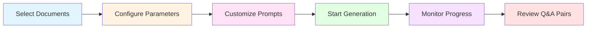

<div align="center">

# 🚀 LLM-DATA-Generator

### Transform Documents into High-Quality LLM Training Data

[](https://www.python.org/)
[](https://reactjs.org/)
[](https://www.typescriptlang.org/)
[](https://flask.palletsprojects.com/)
[](LICENSE)

**A powerful document data extraction application that transforms documents into synthetic LLM training data for fine-tuning.**

*Developed by* **ElHadheqMind** 💡

[Features](#-features) • [Installation](#-installation) • [Usage](#-usage) • [Tech Stack](#-technology-stack) • [Support](#-support)

</div>

---

## 📖 Overview

**LLM-DATA-Generator** is a modern web application designed to convert documents into synthetic training data for LLM fine-tuning. It combines intelligent document processing with AI-powered question generation to create high-quality datasets for machine learning models.

### 🎯 What It Does

- 📄 **Extracts** hierarchical content from documents
- 🤖 **Generates** AI-powered question-answer pairs
- 📊 **Creates** ready-to-use datasets for training and fine-tuning language models
- ⚡ **Provides** a seamless experience with React frontend and Flask backend

---

## ✨ Features

### 📄 Document Processing

<table>
<tr>
<td width="50%">

#### 🔍 Smart Extraction
- **Multi-Format Support** - Process PDF documents with various structures
- **Hierarchical Detection** - Auto-detects section hierarchies
  - Section → Subsection → Subsubsection → Content
- **Dual Strategy** - TOC extraction + regex pattern matching

</td>
<td width="50%">

#### ⚡ Powerful Processing
- **Batch Processing** - Upload multiple documents simultaneously
- **Excel Export** - Formatted exports with multiple options
- **Real-time Preview** - View extracted data instantly

</td>
</tr>
</table>

### 🤖 AI-Powered Synthetic Data Generation

<table>
<tr>
<td width="50%">

#### 🎨 Generation Features
- **Q&A Generation** - Transform content into training data
- **Fine-Tuning Ready** - Optimized for LLM workflows
- **Customizable Prompts** - Configure system prompts
- **Real-time Progress** - Live generation tracking

</td>
<td width="50%">

#### 🌐 Multiple AI Providers
**Cloud APIs:**
- 🟢 OpenAI (GPT-4, GPT-3.5-Turbo)
- 🔵 Google Gemini (1.5 Flash, 1.5 Pro)

**Open Source (Local):**
- 🟣 Ollama (Llama, Mistral, etc.)
- 🟠 LM Studio (User-friendly interface)

</td>
</tr>
</table>

### 🔒 Security & Privacy

```
✅ Client-Side Storage      → API keys in browser localStorage only
✅ No Backend Persistence   → Credentials never stored on server
✅ Multi-User Support       → No authentication required
✅ Per-Request Auth         → Complete isolation between users
✅ Privacy First            → Zero credential persistence
```

### 🎨 User Experience

| Feature | Description |
|---------|-------------|
| 🎯 **Minimal UI** | Clean, distraction-free interface |
| ⚡ **Real-time Updates** | Live progress tracking |
| 🛡️ **Error Handling** | Clear messages & robust recovery |
| 📘 **Type Safety** | Full TypeScript implementation |

---

## 🚀 Installation

### 📋 Prerequisites

<table>
<tr>
<td align="center" width="25%">

<br><strong>Python</strong>
<br>3.8+
</td>
<td align="center" width="25%">

<br><strong>Node.js</strong>
<br>16+
</td>
<td align="center" width="25%">

<br><strong>npm</strong>
<br>Package Manager
</td>
<td align="center" width="25%">

<br><strong>Git</strong>
<br>Version Control
</td>
</tr>
</table>

### 📥 Quick Start

#### **Step 1️⃣: Clone the Repository**

```bash
git clone <repository-url>
cd LLM-DATA-Generator
```

#### **Step 2️⃣: Backend Setup**

```bash
# Install Python dependencies
pip install -r requirements.txt
```

<details>
<summary>💡 <strong>Alternative: Using Virtual Environment (Recommended)</strong></summary>

```bash
# Create virtual environment
python -m venv venv

# Activate virtual environment
# Windows:
venv\Scripts\activate
# Linux/Mac:
source venv/bin/activate

# Install dependencies
pip install -r requirements.txt
```
</details>

#### **Step 3️⃣: Frontend Setup**

```bash
# Navigate to frontend directory
cd frontend

# Install Node.js dependencies
npm install

# Return to root directory
cd ..
```

#### **Step 4️⃣: Configuration**

> 🎉 **No configuration files needed!** API keys are managed through the application UI and stored securely in your browser.

---

## 💻 Usage

### 🎬 Starting the Application

<table>
<tr>
<td width="50%">

#### 🔧 Option 1: Manual Start

**Terminal 1 - Backend:**
```bash
cd backend
python app.py
```

**Terminal 2 - Frontend:**
```bash
cd frontend
npm run dev
```

</td>
<td width="50%">

#### ⚡ Option 2: Quick Start (Windows)

**Backend:**
```bash
cd backend
start-backend.bat
```

**Frontend:**
```bash
cd frontend
npm run dev
```

</td>
</tr>
</table>

### 🌐 Accessing the Application

<div align="center">

| Service | URL | Description |
|---------|-----|-------------|
| 🎨 **Frontend** | [`http://localhost:5173`](http://localhost:5173) | Main application interface |
| 🔌 **Backend API** | [`http://localhost:5000`](http://localhost:5000) | REST API endpoint |

</div>

---

### 📚 Step-by-Step Guide

#### **1️⃣ Configure AI Providers** (First Time Setup)

```
🔧 Click "AI Providers" button in the header
   ↓
🤖 Choose your preferred AI provider:
   • OpenAI → Add API key for GPT-4 or GPT-3.5-Turbo
   • Google Gemini → Add API key for Gemini models
   • Ollama → Configure local endpoint (http://localhost:11434)
   • LM Studio → Configure local endpoint
   ↓
✅ Test the connection
   ↓
💾 Save settings (stored in browser only)
```

#### **2️⃣ Upload Documents**

- 📤 **Drag and drop** PDF files or click to browse
- 📚 **Upload multiple** documents at once
- ✏️ **Rename or reorder** documents as needed

#### **3️⃣ Process Documents**

- 🔄 Click **"Process"** on individual documents or **"Process All"**
- 👁️ View **extracted hierarchical data** in real-time
- 📋 Review the **structured content**

#### **4️⃣ Generate Synthetic Training Data**



- ✅ **Select** processed documents
- ⚙️ **Configure** generation parameters (temperature, tokens, etc.)
- 🎨 **Customize** system prompts for your fine-tuning needs
- 🚀 **Start** generation and monitor progress
- 📝 **Review** generated question-answer pairs

#### **5️⃣ Export Fine-Tuning Datasets**

<div align="center">

| Export Type | Format | Use Case |
|-------------|--------|----------|
| 📊 **Extracted Data** | Excel | Document structure analysis |
| 🤖 **Q&A Datasets** | JSON/JSONL | LLM fine-tuning |
| 📁 **Multiple Formats** | Various | Flexible integration |

</div>

---

## 🛠️ Technology Stack

<div align="center">

### Backend Technologies

<table>
<tr>
<td align="center" width="20%">

<br><strong>Flask</strong>
<br><sub>Web Framework</sub>
</td>
<td align="center" width="20%">

<br><strong>PyMuPDF</strong>
<br><sub>PDF Processing</sub>
</td>
<td align="center" width="20%">

<br><strong>OpenPyXL</strong>
<br><sub>Excel Generation</sub>
</td>
<td align="center" width="20%">

<br><strong>Pandas</strong>
<br><sub>Data Processing</sub>
</td>
<td align="center" width="20%">

<br><strong>AI SDKs</strong>
<br><sub>LLM Integration</sub>
</td>
</tr>
</table>

**AI Provider SDKs:**
- 🟢 **OpenAI SDK** - GPT-4 and GPT-3.5-Turbo integration
- 🔵 **Google Generative AI** - Gemini model integration
- 🟣 **Ollama** - Open source model support via local API
- 🟠 **LM Studio** - Open source model support via local API

---

### Frontend Technologies

<table>
<tr>
<td align="center" width="20%">

<br><strong>React 19</strong>
<br><sub>UI Framework</sub>
</td>
<td align="center" width="20%">

<br><strong>TypeScript</strong>
<br><sub>Type Safety</sub>
</td>
<td align="center" width="20%">

<br><strong>Vite</strong>
<br><sub>Build Tool</sub>
</td>
<td align="center" width="20%">

<br><strong>Tailwind CSS</strong>
<br><sub>Styling</sub>
</td>
<td align="center" width="20%">

<br><strong>Axios</strong>
<br><sub>HTTP Client</sub>
</td>
</tr>
</table>

**Additional Libraries:**
- 🎨 **Lucide React** - Beautiful icon library
- 📡 **Axios** - Promise-based HTTP client

</div>

---

## 🤖 AI Provider Support

<div align="center">

### Supported AI Providers

LLM-DATA-Generator supports multiple AI providers for maximum flexibility:

</div>

<table>
<tr>
<td width="50%">

### ☁️ Cloud-Based APIs

<table>
<tr>
<td align="center">

<br><strong>OpenAI</strong>
</td>
<td>
• GPT-4<br>
• GPT-3.5-Turbo<br>
🔑 Requires API key
</td>
</tr>
<tr>
<td align="center">

<br><strong>Google Gemini</strong>
</td>
<td>
• Gemini 1.5 Flash<br>
• Gemini 1.5 Pro<br>
🔑 Requires API key
</td>
</tr>
</table>

</td>
<td width="50%">

### 🏠 Open Source Models (Local)

<table>
<tr>
<td align="center">

<br><strong>Ollama</strong>
</td>
<td>
• Llama, Mistral, etc.<br>
• Run locally<br>
🌐 Configure endpoint
</td>
</tr>
<tr>
<td align="center">

<br><strong>LM Studio</strong>
</td>
<td>
• User-friendly interface<br>
• Local deployment<br>
🌐 Configure endpoint
</td>
</tr>
</table>

</td>
</tr>
</table>

---

### 🔐 API Key Management

<div align="center">

```
┌─────────────────────────────────────────────────────────────┐
│  🔒 Secure Client-Side API Key Management                  │
├─────────────────────────────────────────────────────────────┤
│                                                             │
│  ✅ Browser Storage Only    → localStorage, never server   │
│  ✅ No Persistence          → Refresh clears keys          │
│  ✅ Per-Request Auth        → No server-side storage       │
│  ✅ Multi-User Safe         → Complete isolation           │
│  ✅ Privacy First           → Zero credential persistence  │
│                                                             │
└─────────────────────────────────────────────────────────────┘
```

</div>

> ⚠️ **Security Note**: You'll need to re-enter your API keys after refreshing the page. This is an intentional security feature to prevent unauthorized access.

> 💡 **For Ollama/LM Studio**: Configure the local endpoint URL (e.g., `http://localhost:11434` for Ollama) instead of API keys.

---

## 📁 Supported Document Formats

<div align="center">

| Format | Extension | Features |
|--------|-----------|----------|
| 📄 **PDF** | `.pdf` | ✅ TOC Extraction<br>✅ Regex Pattern Matching<br>✅ Hierarchical Structure |

</div>

---

## 📄 License

<div align="center">

[](https://opensource.org/licenses/MIT)

This project is licensed under the **MIT License**.

</div>

---

## 🆘 Support

<div align="center">

### Need Help? We've Got You Covered!

</div>

<table>
<tr>
<td width="25%" align="center">
<h3>📋</h3>
<strong>Check Logs</strong>
<br><sub>Review application logs for detailed error messages</sub>
</td>
<td width="25%" align="center">
<h3>🔑</h3>
<strong>Verify API Keys</strong>
<br><sub>Ensure your API keys are correctly configured</sub>
</td>
<td width="25%" align="center">
<h3>🚀</h3>
<strong>Check Services</strong>
<br><sub>Ensure both backend and frontend are running</sub>
</td>
<td width="25%" align="center">
<h3>🐛</h3>
<strong>Report Issues</strong>
<br><sub>Create an issue on the project repository</sub>
</td>
</tr>
</table>

---

## 🌟 Acknowledgments

<div align="center">

**Built with ❤️ by ElHadheqMind**

### Professional Document Data Extraction Tool

[](https://www.python.org/)
[](https://reactjs.org/)
[](https://www.typescriptlang.org/)

---

### ⭐ If you find this project useful, please consider giving it a star!

---

**© 2024 ElHadheqMind** | All Rights Reserved

</div>
